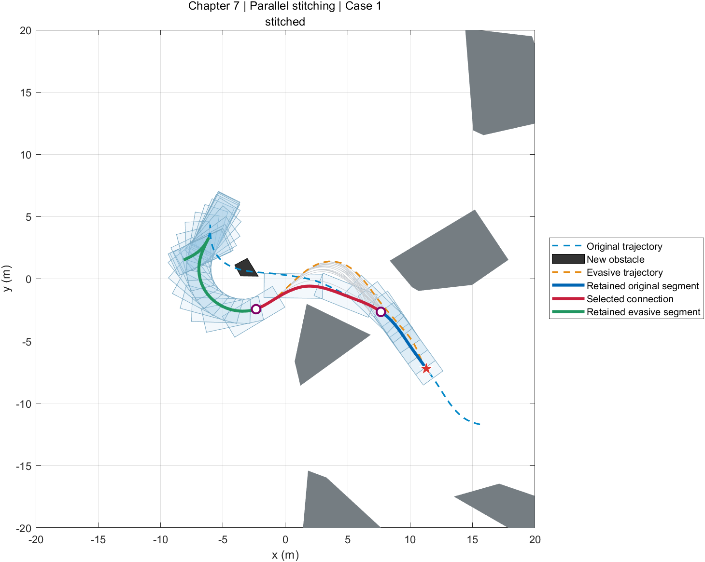
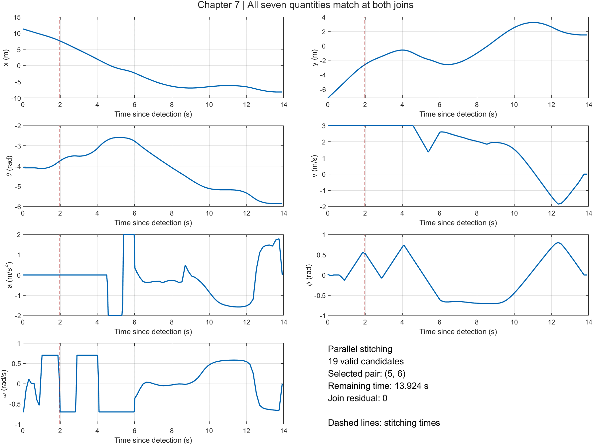
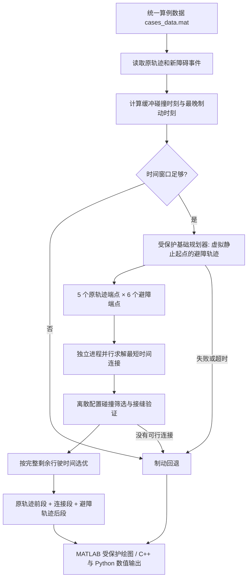

# ParkingTrajectoryReplanner · 第七章：平行缝合

本仓库是中文图书 **《非结构化场景自动驾驶轨迹规划技术》** 第七章“基于并行缝合策略的自主泊车在线轨迹重规划方法”的配套代码。

English title translation: *Trajectory Planning Techniques for Autonomous Driving in Unstructured Environments*. **The book is written in Chinese.** This repository demonstrates Chapter 7's parallel stitching method in MATLAB, C++, and Python.

车辆发现新障碍物后，先从当前位置的虚拟静止状态规划避障轨迹，再并行计算连接段，将原轨迹、连接段、避障轨迹缝合。接缝处同时匹配位置、朝向、速度、加速度、前轮转角和转角速度，避免为了重新规划而先停车。

**研究使用本代码及方法时，请引用：**

> Bai Li, Zhuyan Yin, Yakun Ouyang, Youmin Zhang, Xiang Zhong, and Shiqi Tang, “Online Trajectory Replanning for Sudden Environmental Changes During Automated Parking: A Parallel Stitching Method,” *IEEE Transactions on Intelligent Vehicles*, vol. 7, no. 3, pp. 748–757, September 2022. [DOI: 10.1109/TIV.2022.3156429](https://doi.org/10.1109/TIV.2022.3156429).

BibTeX 见 [CITATION.bib](CITATION.bib)。当前版本采用 [PolyForm Noncommercial 1.0.0](LICENSE)，商业用途需另行获得许可。

## 实际运行效果

以下图片由本仓库 MATLAB 默认 `case_id = 1` 实际求解生成。灰线表示通过碰撞筛选的候选连接；蓝、红、绿三段组成最终轨迹。车辆足迹先画在底层，轨迹曲线叠加在上面。





MATLAB 默认只生成这 **2 张静态图**。这里的“最优”指已求得且通过验证的候选组合中剩余时间最短者；非线性求解不构成全局最优保证。该演示重新计算避障轨迹和连接段，图片不是运行时加载的替代结果。

## 三个版本

| 版本 | 入口 | 求解与封装 | 输出 |
| --- | --- | --- | --- |
| MATLAB | `matlab/RunMe.m` | AMPL/IPOPT 文件交互；LIOM、混合 A*、几何与可视化封装为 `.p` | 两张图、MAT 结果、TXT 日志 |
| C++ | `cpp/parallel_stitching.cpp` | CasADi/IPOPT；基础规划封装为本项目 DLL；独立进程并行 | CSV 轨迹、JSON 报告 |
| Python | `python/parallel_stitching.py` | 同一 CasADi/IPOPT 后端；`multiprocessing` 并行 | CSV 轨迹、JSON 报告 |

**本次提供并验证的是 Windows x64 版本。** C++/Python 不依赖 MATLAB 或 AMPL；当前受保护后端只提供 Windows DLL，没有 Linux/macOS 二进制。C++ 主程序是真正的 C++ 实现，不调用 Python 脚本；安装 Python 包只是获取经过验证的 CasADi 运行库的一种方式。

## MATLAB：一键运行

### 首次安装

1. 安装 MATLAB R2021b 或更新版本、Navigation Toolbox（Reeds–Shepp）及 Image Processing Toolbox（代价地图）。不需要 Parallel Computing Toolbox。
2. 从 [AMPL 官方安装文档](https://dev.ampl.com/ampl/install.html)安装 Windows AMPL，并安装 [IPOPT 的 AMPL 可执行版本](https://dev.ampl.com/solvers/ipopt/index.html)。准备能够求解该模型规模的有效 AMPL 许可。
3. 将 AMPL、IPOPT 及各自随发行包提供的运行库放在本机目录；不要只复制孤立的 EXE。可以放到 `matlab/`，也可以在 MATLAB 中设置一次绝对路径：

```matlab
setenv('AMPL_EXECUTABLE','C:\ampl\ampl.exe');
setenv('IPOPT_EXECUTABLE','C:\ampl\ipopt.exe');
```

仓库不重新分发 AMPL、IPOPT、HSL 或 MathWorks 的第三方程序。`matlab/ipopt.opt` 沿用原始运行环境的 `linear_solver ma27`；如所安装的 IPOPT 不含 MA27，应将这一行改成该发行版支持的线性求解器，例如 `linear_solver mumps`。求解器选择可能影响数值结果。

### 运行

在 MATLAB 中打开 `matlab/RunMe.m`，设置：

```matlab
case_id = 1; % 可选：1, 14, 20, 36, 39, 96, 100, 108
options = struct('workers',4,'enforce_deadline',false,'make_video',false);
```

点击 **Run**。入口自行定位文件，不要求事先添加整棵目录到路径。

- 图 1：原轨迹、避障轨迹、候选连接、选中三段轨迹及足迹。
- 图 2：`x, y, theta, v, a, phi, omega` 的时间曲线。
- `matlab/RunData/last_result.mat`：结果、接缝、验证指标及运行统计。
- `matlab/RunData/evasion/` 和 `connectors/`：本机求解 TXT 与日志；各连接进程使用独立子目录。
- `docs/images/`：本次结果的两张 PNG，运行时会更新。

视频功能聚合在 `StitchingVisualization.p` 内，默认关闭；将 `make_video` 改为 `true` 可额外导出视频，其实现源码不在仓库中。

## Python：安装与运行

安装 Windows x64 Python 3.11 或 3.12，在仓库根目录打开 PowerShell：

```powershell
py -3.11 -m venv .venv
.\.venv\Scripts\python.exe -m pip install -r python\requirements.txt
.\.venv\Scripts\python.exe python\parallel_stitching.py --case 1 --workers 4
```

无需激活虚拟环境。程序自动定位 `casadi==3.7.2` 的 DLL，再加载 `native/win64/parking_backend.dll`。CasADi 版本必须与此受保护二进制匹配。[CasADi 官方文档](https://web.casadi.org/docs/)介绍了安装及 IPOPT 接口。

默认输出 `python/results/trajectory.csv` 和 `report.json`。CSV 列为：

```text
t,x,y,theta,v,a,phi,omega
```

`t` 是与原轨迹共用的绝对时间；结果从发现新障碍的 `t0` 开始。角度单位为 rad，时间单位为 s，长度单位为 m。控制台会报告选中组合、剩余时间和接缝/动力学残差。C++/Python 不提供绘图、视频功能。

## C++：编译与部署

安装 CMake 3.16+ 和支持 C++17 的 Windows x64 编译器，例如 Visual Studio 2022 Build Tools（Desktop development with C++）。先按上一节安装 CasADi 3.7.2，在仓库根目录执行：

```powershell
$casadiRuntime = & .\.venv\Scripts\python.exe -c "import casadi,pathlib; print(pathlib.Path(casadi.__file__).parent)"
cmake -S cpp -B build -A x64
cmake --build build --config Release
.\build\Release\parallel_stitching.exe --runtime "$casadiRuntime" --case 1 --workers 4
```

也可使用 MinGW-w64（本次实测使用此工具链）。先将其 `bin` 加入 PATH，在另一个空构建目录执行：

```powershell
cmake -S cpp -B build-mingw -G "MinGW Makefiles"
cmake --build build-mingw -j 4
.\build-mingw\parallel_stitching.exe --runtime "$casadiRuntime" --case 1 --workers 4
```

默认输出 `cpp/results/trajectory.csv`（同样 8 列，无表头）和 `report.json`。`workers/` 保存各进程的独立输入输出。部署时保留 `data/`、`native/win64/`，安装相同 CasADi 运行库；若移动了仓库目录，运行时用 `--root "D:\ParkingTrajectoryReplanner"` 指定新的仓库根目录。无需重新编译 LIOM 后端，也无需 AMPL。

## 总体架构



### 阅读代码的顺序

| 文件或函数 | 职责 |
| --- | --- |
| `matlab/RunMe.m` | 图书与引用说明、算例选择、一键入口 |
| `RunParallelStitching.m` | 避障规划、并行连接、缝合与回退的总流程 |
| `BuildStitchingTasks.m` | 沿两条轨迹取样，建立 5×6 对连接边界 |
| `SolveCandidatesInParallel.m` | 调度独立 AMPL 进程；局部函数负责写入参数、读回状态和轨迹 |
| `SelectAndAssemble.m` | 碰撞筛选、三个片段拼接、按完整剩余时间选择结果 |
| `Connector.mod` / `SolveConnector.run` | 论文式 (9)–(10) 的公开连接段 OCP 及 TXT 交互 |
| `ParkingBackend.p` | 数据读取、HA*、LIOM、几何检查与制动的受保护基础模块 |
| `StitchingVisualization.p` | 静态轨迹图、状态图和可选视频的聚合受保护模块 |
| `cpp/parallel_stitching.cpp` | C++ 版端点采样、进程调度、验证、拼接与回退 |
| `cpp/parking_backend.hpp` | 受保护后端的 C ABI 适配层 |
| `python/parallel_stitching.py` | Python 版同一平行缝合流程 |
| `python/backend.py` | CasADi 运行库定位与受保护后端的 ctypes 适配层 |
| `native/win64/parking_backend.dll` | 本项目编译的基础规划组件，动态使用外部 CasADi/IPOPT |
| `data/cases_data.mat` | 8 组原始地图、原轨迹、边界与固定新障碍事件 |

除上表中的平行缝合流程及接口外，基础优化、搜索、绘图和视频实现不发布源码。MATLAB 两个受保护函数只提供 `.p`，没有同名 `.m`。P-code 属于可执行的内容隐藏格式，使用说明见 [MathWorks 文档](https://www.mathworks.com/help/matlab/ref/pcode.html)。

## 与论文、图书和原始代码的对应

论文表 I 的车辆参数保持为：`Lw=2.8 m`、`Lf=0.96 m`、`Lr=0.929 m`、`width=1.942 m`、`|v|≤3 m/s`、`|a|≤2 m/s²`、`|phi|≤0.85 rad`、`|omega|≤0.7 rad/s`。缓冲距离 `2 m`；原轨迹取样数 `5`，避障轨迹取样数 `6`；思考时间 `Tthink=1.2 s`；两个相对时间偏移为避障轨迹总时长的 `5%` 与 `30%`。

原始第七章代码的每段优化采用 **100 个配置点**，本版保留这一设置。它不沿用其他章节的 200 点设置。连接模型用一致的前向 Euler 离散，修正原程序中加速度/转角速度索引与位置方程不一致的问题。LIOM 数值模型保留原始后向离散和迭代结构，封装在基础模块内。

当前车辆的实际运动状态保留在原轨迹段中。规划避障轨迹时只取当前位姿，并令其虚拟起点的 `v,a,phi,omega` 为零；不会把车辆实际状态改成静止。连接段固定两端全部 **7 个量**，目标仅为连接时长，不把障碍物约束塞入连接 NLP。随后按车辆矩形足迹检查输出配置点，进行碰撞筛选。

端点窗口沿用本章/原始代码的投影方式：先将原轨迹候选端点投影到避障轨迹的最近位置，再在其后 `5%–30%` 总时长范围取样。最终比较：

```text
remaining_time = (original_join_time - t0)
               + connector_duration
               + (evasive_duration - evasive_join_time)
```

数据保留了 8 对完整原始算例；缺少配对原轨迹的旧 `Case34.mat` 没有被冒充为可运行算例。原轨迹作为重规划输入，本身来自作者原有离线结果；新障碍按原有生成思路固定种子并保存，使每次运行可复现。`cases_data.mat` 是打包数据，不是加密格式。

C++/Python 共享 CasADi 后端，MATLAB 保留原有 AMPL 与 Reeds–Shepp 基础实现。原生后端采用独立的 HA* 初始化和前进/倒车解析连接；两类基础规划器与线性求解器不同，因此 MATLAB 与原生版本的避障轨迹、局部解和最优候选不承诺逐点相同。平行缝合流程、车辆约束、边界匹配和完整剩余时间选优保持一致。

## 思考时间与回退

默认是完整教学演示：计算全部 30 个候选，观察方法效果。`Tthink=1.2` 仍用于原轨迹连接窗口，但默认不因实际计算耗时而中断演示。**默认运行不是“1.2 秒内完成”的性能声明。**

Python/C++ 加 `--deadline` 时，将 1.2 秒作为在线求解预算，超时终止尚在运行的工作进程；没有按时获得有效连接就输出制动回退。进程终止及操作系统调度有开销，这不是硬实时控制器。Python 在计时前预建工作池，C++ 计时包含子进程启动。

MATLAB 的 `enforce_deadline=true` 会拒绝迟到的避障结果，并终止仍在运行的连接进程；同步执行的避障规划器本身无法在中途被此开关打断，因此该开关不保证 MATLAB 函数在 1.2 秒返回。

论文描述的是反应式制动回退；这里输出恒定转角、最大减速度的离散制动演示轨迹，并报告其碰撞检查结果。后续重新起步/闭环控制不在本示例范围内。

默认算例的真实验证指标和截止时间测试见 [docs/VALIDATION.md](docs/VALIDATION.md)。只验证离散配置点，不额外实现配置点之间的连续扫掠碰撞证明。

## 许可与第三方软件

本次发布的项目代码、数据及项目自有受保护组件按 [LICENSE](LICENSE) 提供，保留 [NOTICE](NOTICE) 与论文引用。商业使用请联系仓库作者。由于包含非商用限制及受保护组件，本仓库不是完整源码的 OSI 开源发行版。

MathWorks、AMPL、CasADi、IPOPT 及其依赖遵守各自许可，见 [THIRD_PARTY_NOTICES.md](THIRD_PARTY_NOTICES.md)。本次许可变更适用于此次发布；之前已经按旧许可获得的历史版本，其既有授权不因此被撤回。仓库当前文件树已经重新整理，Git 历史保留。
